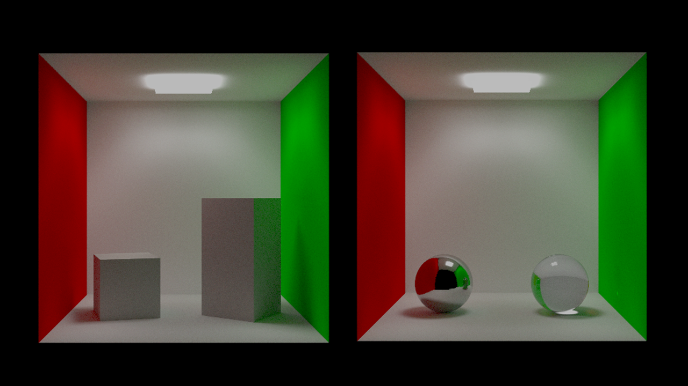
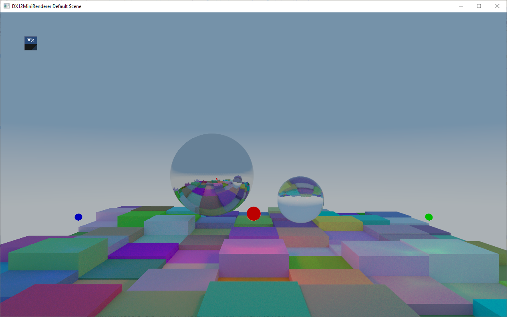

# DX12 Mini Renderer

This is a Dx12 renderer practice project to experiment DX12 programming and various real-time rendering techniques. It will keep using original Dx12 API instead of Dx12 wrappers and keep abstractions as less as possible to facilitate referring.






## Current Features
* DXR Path Tracer Backend and Rasterization Forward Backend.
* DXR Path Tracer: Diffuse, Metal, Glass Materials; Area Lights.
* Rasterization Forward Render: GLTF PBR support, Point Lights, etc.
* Base Framework: GLTF Loaderer, Yaml Based Scene Definiation, etc.

## Pull it

```
git clone --recurse-submodules https://github.com/JerryYan97/DX12MiniRenderer.git
```

## Build It
Just execute the following cmd under the project folder
```
cmake -S . -B build
```

## Use it

```
C:\DX12MiniRenderer\build\Debug>DX12MiniRenderer.exe -h
  DX12MiniRenderer.exe {OPTIONS}

    DX12 Mini-Renderer. Supports Rasterization/Raytracing Backend and various
    scenes.

  OPTIONS:

      -h, --help                        Display this help menu
      -s, --scene                       The render scene idx.

    E.g. DX12MiniRenderer.exe --scene 1
    (0):Avocado
    (1):CornellBox
    (2):CornellBoxMultiMaterials
    (3):Cube
    (4):Duck
    (5):DXRMilestoneScene
    (6):Fish
    (7):Fox
    (8):PBRSpheresPtLights
    (9):Spanza
    (10):Sphere
    (11):TexturedCube
    (12):Triangle
    (13):WaterBottle
```