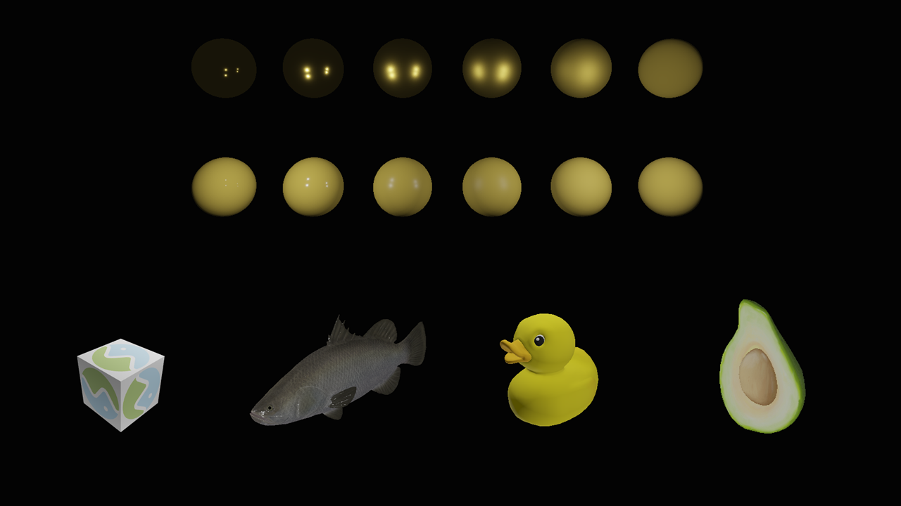

# DX12 Mini Renderer

This is a Dx12 renderer practice project to experiment DX12 programming and various real-time rendering techniques. It will keep using original Dx12 API instead of Dx12 wrappers and keep abstractions as less as possible to facilitate referring.

## Current Features
* GLTF Loaderer and GLTF PBR support
* Point Lights
* Yaml Based Scene Definiation